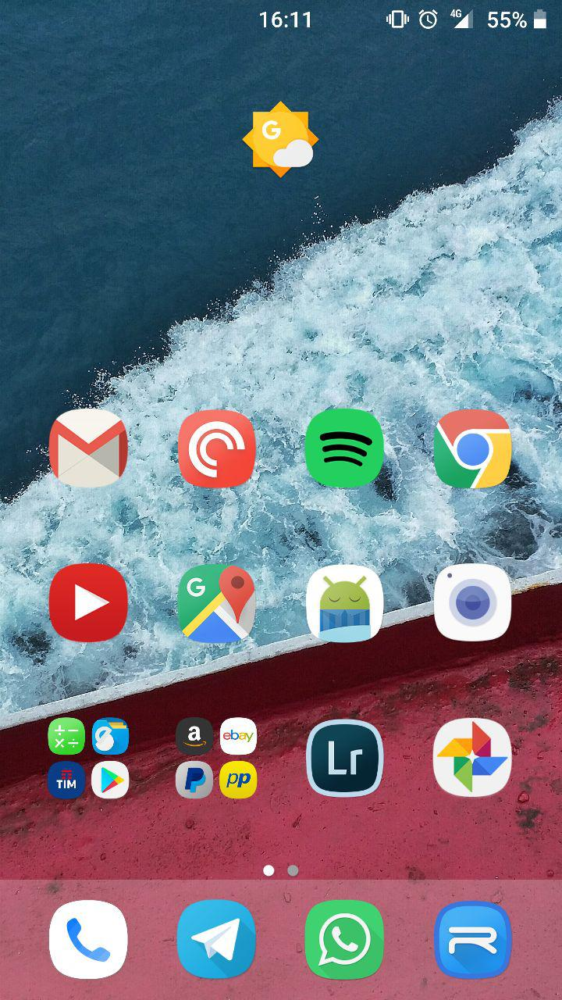

[Home](/index.md)     >     [DuckyROM](/duckyrom.md)
# Ducky ROM

## Download:

- DuckyROM v1.3: _coming 20 November 2017_
- DuckyROM v1.1: https://goo.gl/LLYn48

## Features:
<ol>
  <li>Based on november samsung stock build</li>
  <li>Aroma Installer</li>
  <li>Deodexed</li>
  <li>Deknoxed</li>
  <li>Debloat based on Aria's Odexlite list</li>
  <li>Zip-Aligned</li>
  <li>Busybox + SQlite</li>
</ol>

## To-Do List
- [x] learn to add aroma mods
- [x] add recent apps lock icon
- [ ] change default language to english
- [ ] change default wallpaper
- [ ] change stock statusbar icons with aosp icons
- [ ] add centre clock aroma mod
- [ ] add USSD codes

## Change history:
- v1.3  
Removed all csc specific stuff  
Added first custom mod in aroma
- v1.1   
added custom build string in settings
- v1.0   
Initial release

## Known bugs:
1. USSD Codes not working
2. Problem with Device Maintenance update warning
