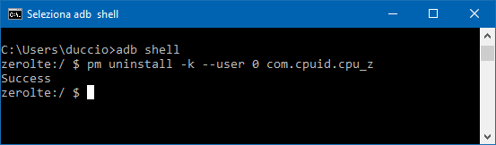

[Home](/index.md)   >   [Tips & Tricks](/tips.md)

# Calibrating your new battery
To calibrate your battery, simply discharge your phone to 0% (until it shuts off), then charge it to 100% without turning it on.
Repeat this step one or two times and everything should work.

To know if your battery is calibrated correctly, try using [AccuBattery](https://play.google.com/store/apps/details?id=com.digibites.accubattery), after some charge cycles it will display a calculated capacity. This number should be around 3600mAh or more:  

# Forcing a reset of the battery stats

[Click here for more calibration methods](/calibration.md)

# Fix device forgetting Wifi networks / Bluetooth broken

1. With any `build.prop` editor or your root file manager edit your `build.prop` and set `ro.securestorage.support = false`.
2. Save `build.prop` and download fix zip file to sd card. (use `#fixwifi` command in the telegram chatroom)
3. Reboot in recovery mode and flash that zip file.
4. Reboot system

# Fixing the gap on your back cover

The Galaxy S7edge batteries usually are 1 millimiter thicker than stock batteries, but it's possible that some arrive thinner than others. If your battery isn't very thin, you will need to use this method to fix the little gap between the back cover and the phone.

[Picture of the 5 screws](https://i.imgur.com/cB60Lku.jpg)

Open up your phone and turn these screws counter-clockwise. You will see that where you unscrew them, the screen will move away from the body of the phone, this way it will make more space for the back cover. Of course you don't have to make a gap behind the screen, you just need to find the right distance of the screws so that the back cover fits well without separating the screen.

[Picture of the fixed gap](https://i.imgur.com/2RzlxEv.jpg)

# Removing extra bloatware from any device (by /u/dosangst)

1. Install USB drivers for your [Device](https://developer.android.com/studio/run/oem-usb.html)
2. [Download](http://lifehacker.com/the-easiest-way-to-install-androids-adb-and-fastboot-to-1586992378) and Install ADB tools
3. Enable[ Developer Options](http://wccftech.com/enable-developer-options-android-nougat/) and [USB Debugging](https://technosamigos.com/enable-usb-debugging-on-android-nougat-phones/)
4. Find a good USB cable, plug it into your computer and then to your device. When the pop-up appears asking you to authorize the device, allow it. 
5. Open a command prompt (cmd in windows) and type:  
        `adb devices`
6. This should return the ID of your device. If not, please go back and retrace your steps.
7.  Use the following commands to find the apps you want to disable  
        `adb shell pm list packages`
8. Now type:  
        `adb shell`
9. This should give you a new prompt, something to the effect of (device-model):/ - here type the following:   
        `pm uninstall -k --user 0 <name of package>`
This should return 'Success' at which point the package has been removed!  

This has been tried on about half a dozen devices and it works on every single one, including the LG G6, Samsung S8, Google Pixel (Removed System Applications!)

#  Making fingerprint sensor faster 

If you have registered multiple fingers on the sensor, try removing all saved fingerprints, then register just ONE fingerprint, but use all the fingers you want while registering. For example, if you want to register 4 fingers (both index and thumbs), register 0-25% with 1 finger, 25-50% with another, 50-75% with another and 75-100% with last finger.

# Fix Substratum themes not going away / Reset substratum completely

1. Navigate to `\vendor\overlays`
2. Delete all files in that folder
3. Reboot
